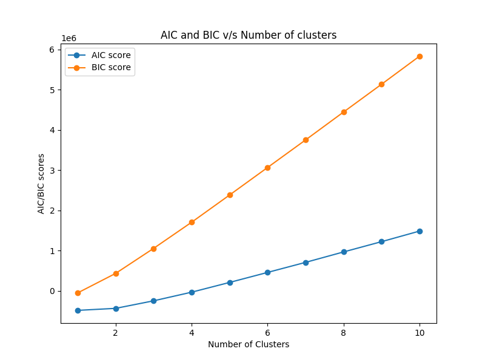
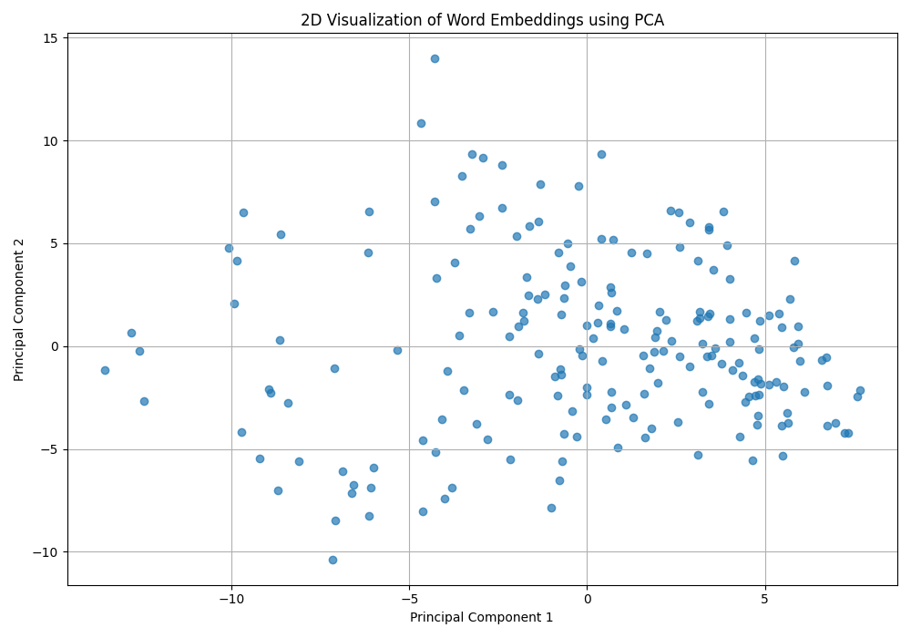
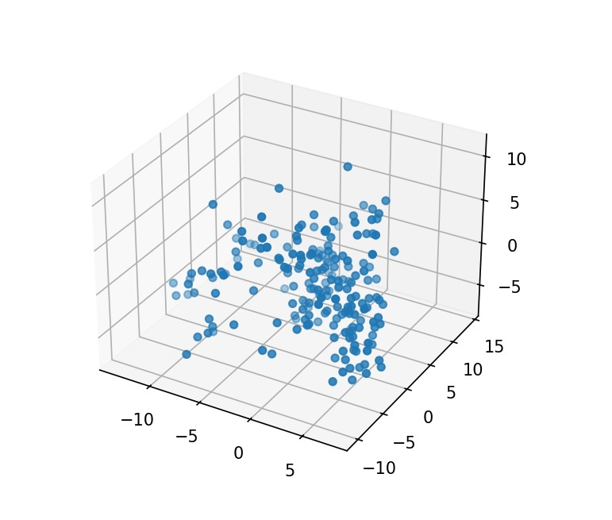

# **Assignment 2 Report**

## **Table of Contents**
3. [K-Means](#KMeans)

4. [GMM](#GMM)

5. [PCA](#PCA)
 
6. [PCA + K-Means](#PCAKMeans)

7. [Cluster Analysis](#ClusterAnalysis)
  
8. [Hierarchical Clustering](#HC)
 
9. [Nearest Neighbor Search - Spotify Dataset](#Spotify)

---

 

 

## **3 Optimal Number of Clusters for 512 dimensions using K-Means**

*Figure 1: Elbow plot for the original 512 dimensional dataset*

**Elbow plot** helps in determining the optimal number of clusters for K-means clustering by plotting the within-cluster sum of squares (WCSS) against number of clusters. The optimal `K` is typically found at the "elbow" point, where adding more clusters yields only marginal improvements.

$$ \text{WCSS} = \sum_{i=1}^K \sum_{x \in C_i} \| x - \mu_i \|^2 $$

where:
- $K$ is the number of clusters,
- $C_i$ is the set of points in cluster $i$,
- $\mu_i$ is the centroid of cluster $i$,
- $x$ is a data point in cluster $i$.

> From the plot we can see that the elbow comes around $k = 7$ hence $k_{kmeans1} = 7$

>Note: Not always the best method: The elbow method might <u>not be suitable</u> for all datasets, especially for those with <u>high dimensionality</u> or clusters of irregular shapes. Hence if you see the graph it is very difficult to identify the elbow point.
---

## **4 GMM**
>The implemented GMM class doesn't work for high dimension data whereas  sckit-learn's GMM class applies some sophesticated techniques/algorithms to handle the case when covariance matrix leads to singular matrix. <u>My model works well and in parallel to the sklearn's model for lower dimentional data.</u>

**Akaike Information Criterion (AIC)** and **Bayesian Information Criterion (BIC)** are used for model selection in Gaussian Mixture Models (GMMs) to balance goodness of fit with model complexity.

- **AIC**: Measures the relative quality of a statistical model, <u>penalizing for the number of parameters</u> to avoid overfitting.
  $$\text{AIC} = 2k - 2 \ln(\hat{L})$$
  where $k$ is the number of parameters and $\hat{L}$ is the maximum likelihood of the model.

- **BIC**: Similar to AIC but with a <u>stronger penalty for model complexity</u>, suitable for larger sample sizes.
  $$\text{BIC} = \ln(n)k - 2 \ln(\hat{L})$$
  where $n$ is the number of observations and $k$ is the number of parameters.

Both criteria help in selecting the model with the best trade-off between fit and complexity. For selecting the suitable value of $k$ we want to minimise both AIC and BIC.

> From the plot we can see that both AIC and BIC are minimum for $k = 1$, hence $k_{gmm1} = 1$

---

## **5 PCA**

