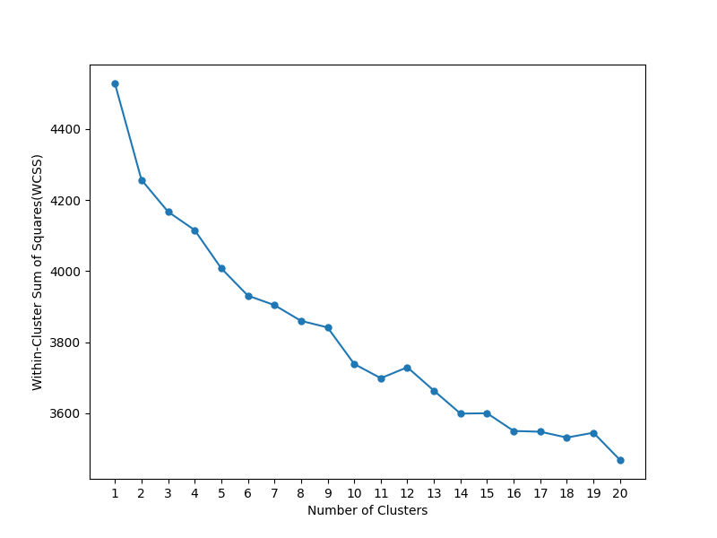

# **Assignment 2 Report**

## **Table of Contents**
3. [K-Means](#KMeans)
  
4. [GMM](#GMM)
  - [Optimal Number of Clusters for 512 dimensions using GMM](#GMM512)
  - [AIC and BIC in GMM](#AICBIC)
  - [GMM clustering using k = k_gmm1](#GMMKGMM1)
5. [PCA](#PCA)
  - [Visualising Dimensionality Reduction](#VisualisingReducedDataset)
  - [Data Analysis](#DataAnalysis)
  - [K-Means using k=k_2](#KMeansK2)
6. [PCA + K-Means](#PCAKMeans)
  - [Scree Plot for determining optimal number of dimensions](#ScreePlotFullDataset)
  - [Elbow plot for reduced Dataset](#ElbowPlotReducedDataset)
  - [K-Means using k=k_kmeans3](#KMeansKMeans3)
  - [GMM using k_2](#GMMK2)
  - [PCA + GMM](#PCAGMM)
  - [GMM using k_gmm3](#GMMGMM3)
7. [Cluster Analysis](#ClusterAnalysis)
  - [K-Means Cluster Analysis](#KMeansClusterAnalysis)
  - [GMM Cluster Analysis](#GMMClusterAnalysis)
  - [GMM and K-Means Comparison](#GMMKMeans)
8. [Hierarchical Clustering](#HC)
  - [Dendrogram Plots](#Dendrograms)
  - [Comparing GMM, K-Means and HC](#GMMKMeansHC)
9. [Nearest Neighbor Search - Spotify Dataset](#Spotify)
  - [PCA + KNN](#PCAKNN)
  - [KNN on reduced dataset using the best_k and best_metric obtained in A1](#Evaluation)

---

## **3.2 Optimal Number of Clusters for 512 dimensions using K-Means**

*Figure 1: Elbow plot for the original 512 dimensional dataset*

An **elbow plot** helps determine the optimal number of clusters for K-means clustering by plotting the within-cluster sum of squares (WCSS) against the number of clusters. The optimal `K` is typically found at the "elbow" point, where adding more clusters yields only marginal improvements.