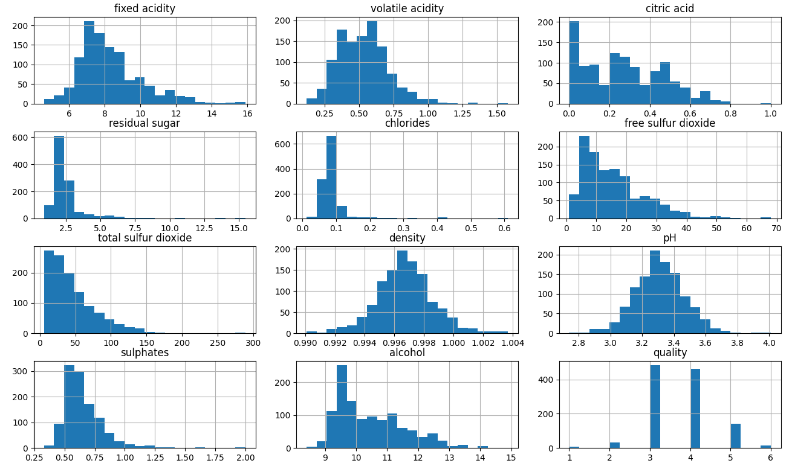
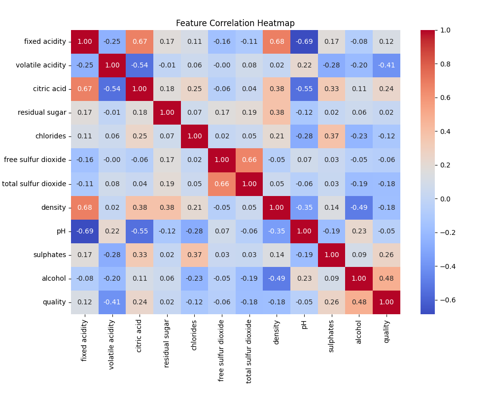
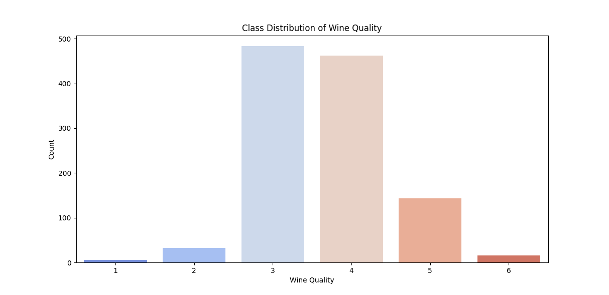

<center>

# **Assignment 3 Report**

</center>

## 2 Multi Layer Perceptron Classification

### **2.1**:
```
       fixed acidity  volatile acidity  citric acid  ...      alcohol      quality           Id
count    1143.000000       1143.000000  1143.000000  ...  1143.000000  1143.000000  1143.000000
mean        8.311111          0.531339     0.268364  ...    10.442111     5.657043   804.969379
std         1.747595          0.179633     0.196686  ...     1.082196     0.805824   463.997116
min         4.600000          0.120000     0.000000  ...     8.400000     3.000000     0.000000
25%         7.100000          0.392500     0.090000  ...     9.500000     5.000000   411.000000
50%         7.900000          0.520000     0.250000  ...    10.200000     6.000000   794.000000
75%         9.100000          0.640000     0.420000  ...    11.100000     6.000000  1209.500000
max        15.900000          1.580000     1.000000  ...    14.900000     8.000000  1597.000000

[8 rows x 13 columns]
Means:
 fixed acidity             8.311111
volatile acidity          0.531339
citric acid               0.268364
residual sugar            2.532152
chlorides                 0.086933
free sulfur dioxide      15.615486
total sulfur dioxide     45.914698
density                   0.996730
pH                        3.311015
sulphates                 0.657708
alcohol                  10.442111
quality                   5.657043
Id                      804.969379
dtype: float64
Standard Deviations:
 fixed acidity             1.747595
volatile acidity          0.179633
citric acid               0.196686
residual sugar            1.355917
chlorides                 0.047267
free sulfur dioxide      10.250486
total sulfur dioxide     32.782130
density                   0.001925
pH                        0.156664
sulphates                 0.170399
alcohol                   1.082196
quality                   0.805824
Id                      463.997116
dtype: float64
Min values:
 fixed acidity           4.60000
volatile acidity        0.12000
citric acid             0.00000
residual sugar          0.90000
chlorides               0.01200
free sulfur dioxide     1.00000
total sulfur dioxide    6.00000
density                 0.99007
pH                      2.74000
sulphates               0.33000
alcohol                 8.40000
quality                 3.00000
Id                      0.00000
dtype: float64
Max values:
 fixed acidity             15.90000
volatile acidity           1.58000
citric acid                1.00000
residual sugar            15.50000
chlorides                  0.61100
free sulfur dioxide       68.00000
total sulfur dioxide     289.00000
density                    1.00369
pH                         4.01000
sulphates                  2.00000
alcohol                   14.90000
quality                    8.00000
Id                      1597.00000
dtype: float64
```
### Overview of Dataset:
The dataset used in this project is WineQT.csv, which contains the following features:
```
fixed acidity
volatile acidity
citric acid
residual sugar
chlorides
free sulfur dioxide
total sulfur dioxide
density
pH
sulphates
alcohol
quality
Id
```
The target variable is `quality`, which is converted into categorical labels `(bad, average, good)` for the purpose of classification.

### **2.2**:
<center>







</center>

## 2.2 Building MLP
```
Accuracy: 0.5327510917030568
F1 Score: 0.560145925631015
Classification Report:
              precision    recall  f1-score   support

           1       0.00      0.00      0.00         0
           2       0.00      0.00      0.00         7
           3       0.74      0.72      0.73       100
           4       0.58      0.52      0.55        86
           5       0.56      0.17      0.26        30
           6       0.00      0.00      0.00         6

    accuracy                           0.53       229
   macro avg       0.31      0.23      0.26       229
weighted avg       0.62      0.53      0.56       229

Numeric: 0.01281646502038214, Analytic: 0.019674001244321025

Gradient check passed: False
```
The Gradient check is failing during this testing it's becasue the gradient computed numeracilly do not match with gradient computed analytically during backpropagation. I suspect the reason for gradient failure in this step is that activation functions are facing an exploding gradient issue.

## 2.3 Hyperparameter Tuning