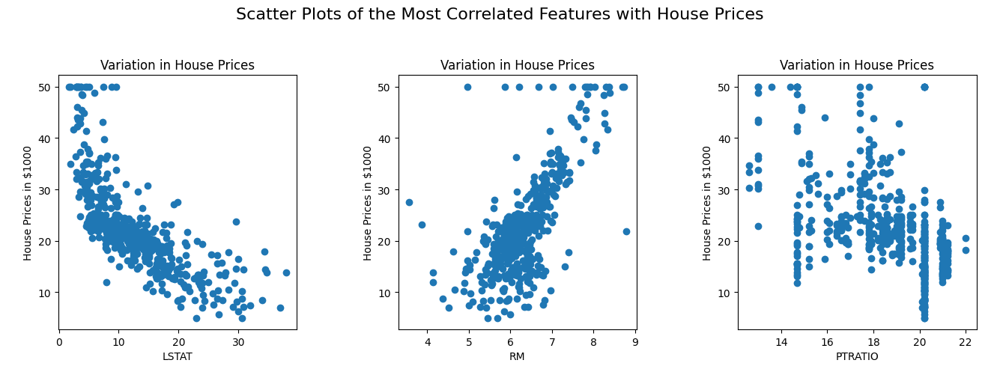

<center>

# **Assignment 3 Report**

</center>

## 2 Multi Layer Perceptron Classification

### **2.1**:
```
       fixed acidity  volatile acidity  citric acid  ...      alcohol      quality           Id
count    1143.000000       1143.000000  1143.000000  ...  1143.000000  1143.000000  1143.000000
mean        8.311111          0.531339     0.268364  ...    10.442111     5.657043   804.969379
std         1.747595          0.179633     0.196686  ...     1.082196     0.805824   463.997116
min         4.600000          0.120000     0.000000  ...     8.400000     3.000000     0.000000
25%         7.100000          0.392500     0.090000  ...     9.500000     5.000000   411.000000
50%         7.900000          0.520000     0.250000  ...    10.200000     6.000000   794.000000
75%         9.100000          0.640000     0.420000  ...    11.100000     6.000000  1209.500000
max        15.900000          1.580000     1.000000  ...    14.900000     8.000000  1597.000000

[8 rows x 13 columns]
Means:
 fixed acidity             8.311111
volatile acidity          0.531339
citric acid               0.268364
residual sugar            2.532152
chlorides                 0.086933
free sulfur dioxide      15.615486
total sulfur dioxide     45.914698
density                   0.996730
pH                        3.311015
sulphates                 0.657708
alcohol                  10.442111
quality                   5.657043
Id                      804.969379
dtype: float64
Standard Deviations:
 fixed acidity             1.747595
volatile acidity          0.179633
citric acid               0.196686
residual sugar            1.355917
chlorides                 0.047267
free sulfur dioxide      10.250486
total sulfur dioxide     32.782130
density                   0.001925
pH                        0.156664
sulphates                 0.170399
alcohol                   1.082196
quality                   0.805824
Id                      463.997116
dtype: float64
Min values:
 fixed acidity           4.60000
volatile acidity        0.12000
citric acid             0.00000
residual sugar          0.90000
chlorides               0.01200
free sulfur dioxide     1.00000
total sulfur dioxide    6.00000
density                 0.99007
pH                      2.74000
sulphates               0.33000
alcohol                 8.40000
quality                 3.00000
Id                      0.00000
dtype: float64
Max values:
 fixed acidity             15.90000
volatile acidity           1.58000
citric acid                1.00000
residual sugar            15.50000
chlorides                  0.61100
free sulfur dioxide       68.00000
total sulfur dioxide     289.00000
density                    1.00369
pH                         4.01000
sulphates                  2.00000
alcohol                   14.90000
quality                    8.00000
Id                      1597.00000
dtype: float64
```
### Overview of Dataset:
The dataset used in this project is WineQT.csv, which contains the following features:
```
fixed acidity
volatile acidity
citric acid
residual sugar
chlorides
free sulfur dioxide
total sulfur dioxide
density
pH
sulphates
alcohol
quality
Id
```
The target variable is `quality`, which is converted into categorical labels `(bad, average, good)` for the purpose of classification.

### **2.2**:
<center>


</center>

## 2.2 Building MLP
```
Accuracy: 0.5327510917030568
F1 Score: 0.560145925631015
Classification Report:
              precision    recall  f1-score   support

           1       0.00      0.00      0.00         0
           2       0.00      0.00      0.00         7
           3       0.74      0.72      0.73       100
           4       0.58      0.52      0.55        86
           5       0.56      0.17      0.26        30
           6       0.00      0.00      0.00         6

    accuracy                           0.53       229
   macro avg       0.31      0.23      0.26       229
weighted avg       0.62      0.53      0.56       229

Numeric: 0.01281646502038214, Analytic: 0.019674001244321025

Gradient check passed: False
```
The Gradient check is failing during this testing it's becasue the gradient computed numeracilly do not match with gradient computed analytically during backpropagation. I suspect the reason for gradient failure in this step is that activation functions are facing an exploding gradient issue.

## 2.3 Hyperparameter Tuning
Wandb links: https://wandb.ai/pingu-73/Question-two-three, https://wandb.ai/pingu-73/New_Q2.3
Best Model's Details:
```
Best Accuracy: 0.6244541484716157 with parameters: {'epochs': 150, 'learning_rate': 0.1, 'hidden_size': 100, 'activation': 'sigmoid'}
```
<center>


</center>

## 2.4 Best Model Analysis
```
Best Model Performance:
Accuracy: 0.6593886462882096
Precision: 0.6062367423687839
Recall: 0.6593886462882096
F1 Score: 0.6271040448254205

Classification Report:
Class        Precision  Recall     F1-Score   Support
1            0.00       0.00       0.00       2
2            0.00       0.00       0.00       9
3            0.72       0.90       0.80       107
4            0.64       0.56       0.60       82
5            0.39       0.36       0.37       25
6            0.00       0.00       0.00       4

accuracy                           0.66       229
macro avg    0.29       0.30       0.29       229
weighted avg 0.61       0.66       0.63       229

Confusion Matrix:
[[ 0  0  2  0  0  0]
 [ 0  0  7  2  0  0]
 [ 0  0 96  9  2  0]
 [ 0  0 27 46  9  0]
 [ 0  0  2 14  9  0]
 [ 0  0  0  1  3  0]]
```
## 2.5 Analyzing Hyperparameters Effects

### Effect of Non-linearity
* best convergence is shown by Relu and tanh activation functions which have almost similar loss by the end of epoch.  
* On the other hand sigmoid turned out to has the worst convergence and has the maximum loss at the end of epoch.  
* Linear is not as bas as sigmoid but its convergence at the same time is not as good as relu and tanh.  

**Therefore we can conclude that relu and tanh are the best options if epoch loss id taken into consideration.**

### Effect of Learning_rate
* Best convergence is obtained from leraing rate = 0.01 which can also be verifies from the best model obatined in previous section  
* Rest of the learning rates converge to a certain extend but later the value remains more or less the same  
* The order of best lr as per epoch loss convergence is :
```
{
    1: 0.01,
    2: 0.0001,
    3: 0.001,
    4: 0.1
}
```

### 2.6 Multi Label MLP
```
Accuracy: 0.34
Hamming Loss: 0.66
Precision: 0.12
Recall: 0.34
F-1 score: 0.17
```

Best model based upon the highest validation precision and least hamming loss is 
```
activation:"tanh"  
batch_size:32  
epochs:200 
hidden_layers: [64,32]  
learning_rate:0.01  
optimizer:"minibatch"
```

Performance on best model:
```
Sample 1:
Original Labels: ('beauty', 'books', 'home', 'sports')
Predicted Labels: ('beauty', 'books')
------------------------------
Sample 2:
Original Labels: ('books', 'electronics', 'food')
Predicted Labels: ('books',)
------------------------------
Sample 3:
Original Labels: ('clothing', 'furniture', 'home', 'sports')
Predicted Labels: ('sports',)
------------------------------
Sample 4:
Original Labels: ('beauty', 'electronics', 'home')
Predicted Labels: ('beauty', 'home')
------------------------------
Sample 5:
Original Labels: ('food', 'furniture')
Predicted Labels: ('furniture',)
------------------------------
Sample 6:
Original Labels: ('beauty', 'books', 'clothing', 'electronics')
Predicted Labels: ('clothing',)
------------------------------
Sample 7:
Original Labels: ('books', 'home')
Predicted Labels: ('books',)
------------------------------
Sample 8:
Original Labels: ('furniture',)
Predicted Labels: ('furniture',)
------------------------------
Sample 9:
Original Labels: ('beauty', 'books', 'food', 'home')
Predicted Labels: ('beauty', 'books', 'electronics', 'food')
------------------------------
Sample 10:
Original Labels: ('books', 'sports')
Predicted Labels: ('beauty', 'sports')
------------------------------
Sample 11:
Original Labels: ('beauty', 'clothing', 'electronics')
Predicted Labels: ('electronics',)
------------------------------
Sample 12:
Original Labels: ('beauty', 'electronics', 'furniture')
Predicted Labels: ('furniture',)
------------------------------
Sample 13:
Original Labels: ('home', 'sports')
Predicted Labels: ('sports',)
------------------------------
Sample 14:
Original Labels: ('sports',)
Predicted Labels: ('sports',)
------------------------------
Sample 15:
Original Labels: ('clothing', 'food', 'home', 'sports')
Predicted Labels: ('clothing',)
------------------------------
Sample 16:
Original Labels: ('food', 'sports')
Predicted Labels: ('sports',)
------------------------------
Sample 17:
Original Labels: ('food', 'furniture')
Predicted Labels: ('food', 'home')
------------------------------
Sample 18:
Original Labels: ('books', 'electronics', 'furniture')
Predicted Labels: ('electronics',)
------------------------------
Sample 19:
Original Labels: ('electronics', 'food', 'furniture')
Predicted Labels: ('food',)
------------------------------
Sample 20:
Original Labels: ('beauty', 'books')
Predicted Labels: ('beauty', 'books')
------------------------------
Sample 21:
Original Labels: ('electronics', 'sports')
Predicted Labels: ('beauty', 'sports')
------------------------------
Sample 22:
Original Labels: ('clothing', 'electronics')
Predicted Labels: ('electronics',)
------------------------------
Sample 23:
Original Labels: ('beauty', 'clothing', 'food')
Predicted Labels: ('food',)
------------------------------
Sample 24:
Original Labels: ('clothing', 'food', 'home')
Predicted Labels: ('food',)
------------------------------
Sample 25:
Original Labels: ('beauty', 'clothing', 'home')
Predicted Labels: ('home', 'sports')
------------------------------
Sample 26:
Original Labels: ('beauty', 'electronics', 'food', 'home')
Predicted Labels: ('electronics',)
------------------------------
Sample 27:
Original Labels: ('beauty', 'clothing')
Predicted Labels: ('clothing',)
------------------------------
Sample 28:
Original Labels: ('beauty', 'clothing')
Predicted Labels: ('beauty', 'books')
------------------------------
Sample 29:
Original Labels: ('books', 'furniture')
Predicted Labels: ('books',)
------------------------------
Sample 30:
Original Labels: ('furniture',)
Predicted Labels: ('beauty', 'furniture')
------------------------------
Sample 31:
Original Labels: ('electronics',)
Predicted Labels: ('electronics', 'home')
------------------------------
Sample 32:
Original Labels: ('beauty', 'furniture', 'sports')
Predicted Labels: ('beauty', 'sports')
------------------------------
Sample 33:
Original Labels: ('beauty', 'clothing', 'home')
Predicted Labels: ('beauty',)
------------------------------
Sample 34:
Original Labels: ('electronics', 'food', 'furniture')
Predicted Labels: ('electronics',)
------------------------------
Sample 35:
Original Labels: ('food', 'furniture')
Predicted Labels: ('food',)
------------------------------
Sample 36:
Original Labels: ('food',)
Predicted Labels: ('food',)
------------------------------
Sample 37:
Original Labels: ('books', 'electronics')
Predicted Labels: ('beauty', 'books')
------------------------------
Sample 38:
Original Labels: ('beauty', 'books')
Predicted Labels: ('books',)
------------------------------
Sample 39:
Original Labels: ('books', 'furniture', 'sports')
Predicted Labels: ('books',)
------------------------------
Sample 40:
Original Labels: ('food', 'furniture', 'home')
Predicted Labels: ('home',)
------------------------------
Sample 41:
Original Labels: ('food', 'home')
Predicted Labels: ('home',)
------------------------------
Sample 42:
Original Labels: ('books', 'clothing', 'electronics', 'food', 'furniture')
Predicted Labels: ('books', 'clothing')
------------------------------
Sample 43:
Original Labels: ('food', 'sports')
Predicted Labels: ('sports',)
------------------------------
Sample 44:
Original Labels: ('books', 'clothing', 'home')
Predicted Labels: ('clothing',)
------------------------------
Sample 45:
Original Labels: ('books', 'furniture', 'home')
Predicted Labels: ('home',)
------------------------------
Sample 46:
Original Labels: ('electronics', 'home')
Predicted Labels: ('electronics',)
------------------------------
Sample 47:
Original Labels: ('clothing', 'electronics', 'food')
Predicted Labels: ('clothing',)
------------------------------
Sample 48:
Original Labels: ('beauty', 'books')
Predicted Labels: ('beauty',)
------------------------------
Sample 49:
Original Labels: ('furniture', 'sports')
Predicted Labels: ('sports',)
------------------------------
Sample 50:
Original Labels: ('beauty',)
Predicted Labels: ('beauty',)
------------------------------
Sample 51:
Original Labels: ('beauty', 'electronics', 'home')
Predicted Labels: ('beauty',)
------------------------------
Sample 52:
Original Labels: ('furniture', 'sports')
Predicted Labels: ('furniture',)
------------------------------
Sample 53:
Original Labels: ('beauty', 'home')
Predicted Labels: ('beauty',)
------------------------------
Sample 54:
Original Labels: ('beauty', 'books', 'clothing', 'electronics', 'furniture', 'sports')
Predicted Labels: ('clothing',)
------------------------------
Sample 55:
Original Labels: ('clothing',)
Predicted Labels: ('clothing',)
------------------------------
Sample 56:
Original Labels: ('books', 'furniture', 'home', 'sports')
Predicted Labels: ('furniture',)
------------------------------
Sample 57:
Original Labels: ('books', 'clothing', 'electronics', 'home')
Predicted Labels: ('home',)
------------------------------
Sample 58:
Original Labels: ('books', 'home')
Predicted Labels: ('books',)
------------------------------
Sample 59:
Original Labels: ('beauty', 'clothing', 'food')
Predicted Labels: ('clothing',)
------------------------------
Sample 60:
Original Labels: ('home',)
Predicted Labels: ('home',)
------------------------------
Sample 61:
Original Labels: ('beauty',)
Predicted Labels: ('beauty',)
------------------------------
Sample 62:
Original Labels: ('clothing', 'electronics', 'sports')
Predicted Labels: ('electronics',)
------------------------------
Sample 63:
Original Labels: ('beauty', 'food', 'home')
Predicted Labels: ('food',)
------------------------------
Sample 64:
Original Labels: ('beauty', 'books', 'clothing', 'food', 'home', 'sports')
Predicted Labels: ('beauty',)
------------------------------
Sample 65:
Original Labels: ('beauty', 'home', 'sports')
Predicted Labels: ('beauty',)
------------------------------
Sample 66:
Original Labels: ('beauty', 'books', 'food', 'sports')
Predicted Labels: ('beauty',)
------------------------------
Sample 67:
Original Labels: ('books', 'electronics')
Predicted Labels: ('beauty', 'books')
------------------------------
Sample 68:
Original Labels: ('clothing', 'food', 'sports')
Predicted Labels: ('sports',)
------------------------------
Sample 69:
Original Labels: ('beauty',)
Predicted Labels: ('beauty', 'food', 'furniture')
------------------------------
Sample 70:
Original Labels: ('beauty', 'electronics')
Predicted Labels: ('electronics', 'furniture')
------------------------------
Sample 71:
Original Labels: ('books', 'home')
Predicted Labels: ('home',)
------------------------------
Sample 72:
Original Labels: ('books', 'sports')
Predicted Labels: ('sports',)
------------------------------
Sample 73:
Original Labels: ('food', 'furniture')
Predicted Labels: ('food',)
------------------------------
Sample 74:
Original Labels: ('books', 'clothing', 'electronics', 'furniture')
Predicted Labels: ('books',)
------------------------------
Sample 75:
Original Labels: ('beauty', 'books', 'furniture')
Predicted Labels: ('beauty',)
------------------------------
Sample 76:
Original Labels: ('books', 'electronics', 'home', 'sports')
Predicted Labels: ('sports',)
------------------------------
Sample 77:
Original Labels: ('sports',)
Predicted Labels: ('sports',)
------------------------------
Sample 78:
Original Labels: ('electronics',)
Predicted Labels: ('electronics',)
------------------------------
Sample 79:
Original Labels: ('home',)
Predicted Labels: ('home',)
------------------------------
Sample 80:
Original Labels: ('books', 'food', 'furniture', 'sports')
Predicted Labels: ('books',)
------------------------------
Sample 81:
Original Labels: ('beauty', 'books', 'home')
Predicted Labels: ('beauty', 'books', 'food')
------------------------------
Sample 82:
Original Labels: ('books', 'clothing', 'sports')
Predicted Labels: ('books', 'food')
------------------------------
Sample 83:
Original Labels: ('beauty', 'clothing', 'home')
Predicted Labels: ('home',)
------------------------------
Sample 84:
Original Labels: ('electronics', 'sports')
Predicted Labels: ('beauty', 'books', 'sports')
------------------------------
Sample 85:
Original Labels: ('furniture', 'home', 'sports')
Predicted Labels: ('furniture',)
------------------------------
Sample 86:
Original Labels: ('food', 'home')
Predicted Labels: ('home',)
------------------------------
Sample 87:
Original Labels: ('beauty', 'books', 'food')
Predicted Labels: ('books',)
------------------------------
Sample 88:
Original Labels: ('books', 'sports')
Predicted Labels: ('sports',)
------------------------------
Sample 89:
Original Labels: ('books', 'food', 'home')
Predicted Labels: ('books', 'clothing')
------------------------------
Sample 90:
Original Labels: ('beauty', 'clothing', 'furniture', 'home', 'sports')
Predicted Labels: ('home',)
------------------------------
Sample 91:
Original Labels: ('clothing', 'food')
Predicted Labels: ('clothing',)
------------------------------
Sample 92:
Original Labels: ('books', 'clothing', 'sports')
Predicted Labels: ('clothing',)
------------------------------
Sample 93:
Original Labels: ('books', 'clothing')
Predicted Labels: ('books',)
------------------------------
Sample 94:
Original Labels: ('food', 'home')
Predicted Labels: ('home',)
------------------------------
Sample 95:
Original Labels: ('books', 'electronics', 'furniture', 'home')
Predicted Labels: ('books', 'furniture')
------------------------------
Sample 96:
Original Labels: ('sports',)
Predicted Labels: ('sports',)
------------------------------
Sample 97:
Original Labels: ('clothing', 'home')
Predicted Labels: ('home',)
------------------------------
Sample 98:
Original Labels: ('beauty', 'clothing', 'sports')
Predicted Labels: ('beauty',)
------------------------------
Sample 99:
Original Labels: ('clothing',)
Predicted Labels: ('beauty', 'clothing', 'home')
------------------------------
Sample 100:
Original Labels: ('books', 'home')
Predicted Labels: ('home',)
------------------------------

Accuracy: 0.12
Precision: 0.42412451361867703
Recall: 0.8449612403100775
F1 Score: 0.5647668393782384
```

## 

## 3
### 3.1
#### Analysis of Dataset
```
      CRIM    ZN  INDUS  CHAS    NOX     RM   AGE     DIS  RAD  TAX  PTRATIO       B  LSTAT  MEDV
0  0.00632  18.0   2.31   0.0  0.538  6.575  65.2  4.0900    1  296     15.3  396.90   4.98  24.0
1  0.02731   0.0   7.07   0.0  0.469  6.421  78.9  4.9671    2  242     17.8  396.90   9.14  21.6
2  0.02729   0.0   7.07   0.0  0.469  7.185  61.1  4.9671    2  242     17.8  392.83   4.03  34.7
3  0.03237   0.0   2.18   0.0  0.458  6.998  45.8  6.0622    3  222     18.7  394.63   2.94  33.4
4  0.06905   0.0   2.18   0.0  0.458  7.147  54.2  6.0622    3  222     18.7  396.90    NaN  36.2
(506, 14)
CRIM       20
ZN         20
INDUS      20
CHAS       20
NOX         0
RM          0
AGE        20
DIS         0
RAD         0
TAX         0
PTRATIO     0
B           0
LSTAT      20
MEDV        0
dtype: int64
Checking Coorelation of data
CRIM      -0.391363
ZN         0.373136
INDUS     -0.481772
CHAS       0.181391
NOX       -0.427321
RM         0.695360
AGE       -0.394656
DIS        0.249929
RAD       -0.381626
TAX       -0.468536
PTRATIO   -0.507787
B          0.333461
LSTAT     -0.735822
MEDV       1.000000
Name: MEDV, dtype: float64
```





### 3.2
Wandb links: https://wandb.ai/pingu-73/Question-3, https://wandb.ai/pingu-73/mlp_regression_hyperparameter_tuning


### 3.4 
```
Best Model Parameters: {'hidden_layer_sizes': (100,), 'activation': 'tanh', 'learning_rate': 0.01995074189394607, 'max_iter': 500, 'early_stopping':True, 'validation_split':0.2, 'patience': 10, 'alpha': 0.07554626972671763, 'batch_size': 64}
Best Model Test MSE: 0.3421485315714813
Best Model Test MAE: 0.369556239695163
```

### 3.5 Mean Squared Error vs Binary Cross Entropy
```
Accuracy of BCE model: 0.7532
Accuracy of MSE model: 0.7078
```


### Observations:

**Convergence speed:**

* MSE Loss: The Mean Squared Error (MSE) loss shows a relatively fast decrease initially and then begins to plateau after around 20 epochs, reaching a stable, minimal value by 100 epochs. This indicates that the model rapidly learns from the data at the beginning and then slows down as it converges.  
* BCE Loss : The Binary Cross Entropy (BCE) loss shows a more gradual decline compared to MSE. It steadily decreases across the epochs but does not converge as quickly as MSE. Even at 100 epochs, the BCE loss is still reducing, suggesting slower convergence.

**Overall Loss Scale:**

* MSE Loss: The final MSE loss converges to a value slightly above 0.15. This indicates that the model has minimized the error in terms of squared differences between predicted and actual values.
* BCE Loss: The BCE loss converges to a value around 0.475 by 100 epochs. BCE loss values are naturally higher since they represent a probability-based error metric rather than a squared error.

**MSE vs. BCE in Convergence:**  

* The MSE loss converges faster and reaches a stable minimum earlier compared to the BCE loss.   
* The BCE loss takes more time to decrease, but it continues to improve throughout the training. 
* This behavior reflects the difference in how each loss function handles errors—MSE focusing on squared differences and BCE focusing on probabilities.
* If the model is used for regression tasks, MSE is typically more efficient, while for classification tasks, BCE provides a more fine-grained gradient for learning.

## 4 AutoEncoders

### 4.2 Train the autoencoder
Loss during Training
```
Epoch 1/100, Loss: 0.8144798690888169
Epoch 2/100, Loss: 0.807900434924758
Epoch 3/100, Loss: 0.8015810317329163
Epoch 4/100, Loss: 0.7955113564487419
Epoch 5/100, Loss: 0.7896815142418266
Epoch 6/100, Loss: 0.7840820023406087
Epoch 7/100, Loss: 0.7787036944979837
Epoch 8/100, Loss: 0.7735378260724286
Epoch 9/100, Loss: 0.7685759797002518
Epoch 10/100, Loss: 0.7638100715355435
Epoch 11/100, Loss: 0.7592323380353359
Epoch 12/100, Loss: 0.7548353232683708
Epoch 13/100, Loss: 0.7506118667267245
Epoch 14/100, Loss: 0.74655509162037
Epoch 15/100, Loss: 0.7426583936355379
Epoch 16/100, Loss: 0.7389154301384984
Epoch 17/100, Loss: 0.7353201098071223
Epoch 18/100, Loss: 0.7318665826732607
Epoch 19/100, Loss: 0.7285492305596768
Epoch 20/100, Loss: 0.7253626578958858
Epoch 21/100, Loss: 0.7223016828979009
Epoch 22/100, Loss: 0.7193613290974551
Epoch 23/100, Loss: 0.7165368172068617
Epoch 24/100, Loss: 0.713823557306207
Epoch 25/100, Loss: 0.7112171413401086
Epoch 26/100, Loss: 0.7087133359117704
Epoch 27/100, Loss: 0.7063080753625569
Epoch 28/100, Loss: 0.7039974551257715
Epoch 29/100, Loss: 0.7017777253437765
Epoch 30/100, Loss: 0.6996452847380187
Epoch 31/100, Loss: 0.6975966747219406
Epoch 32/100, Loss: 0.6956285737471538
Epoch 33/100, Loss: 0.6937377918736302
Epoch 34/100, Loss: 0.6919212655550386
Epoch 35/100, Loss: 0.6901760526306977
Epoch 36/100, Loss: 0.6884993275159624
Epoch 37/100, Loss: 0.6868883765831781
Epoch 38/100, Loss: 0.6853405937256553
Epoch 39/100, Loss: 0.6838534760974088
Epoch 40/100, Loss: 0.682424620021702
Epoch 41/100, Loss: 0.6810517170617032
Epoch 42/100, Loss: 0.6797325502468338
Epoch 43/100, Loss: 0.6784649904486377
Epoch 44/100, Loss: 0.6772469929002497
Epoch 45/100, Loss: 0.6760765938537686
Epoch 46/100, Loss: 0.6749519073700775
Epoch 47/100, Loss: 0.6738711222358564
Epoch 48/100, Loss: 0.6728324990027537
Epoch 49/100, Loss: 0.6718343671438709
Epoch 50/100, Loss: 0.670875122322916
Epoch 51/100, Loss: 0.6699532237715607
Epoch 52/100, Loss: 0.6690671917707119
Epoch 53/100, Loss: 0.6682156052315835
Epoch 54/100, Loss: 0.6673970993726103
Epoch 55/100, Loss: 0.6666103634884111
Epoch 56/100, Loss: 0.6658541388071494
Epoch 57/100, Loss: 0.6651272164327919
Epoch 58/100, Loss: 0.6644284353688995
Epoch 59/100, Loss: 0.6637566806207212
Epoch 60/100, Loss: 0.6631108813724883
Epoch 61/100, Loss: 0.6624900092369277
Epoch 62/100, Loss: 0.6618930765741357
Epoch 63/100, Loss: 0.661319134877061
Epoch 64/100, Loss: 0.6607672732209596
Epoch 65/100, Loss: 0.6602366167742869
Epoch 66/100, Loss: 0.6597263253685904
Epoch 67/100, Loss: 0.6592355921250693
Epoch 68/100, Loss: 0.6587636421355508
Epoch 69/100, Loss: 0.6583097311957327
Epoch 70/100, Loss: 0.6578731445886143
Epoch 71/100, Loss: 0.6574531959161346
Epoch 72/100, Loss: 0.6570492259771018
Epoch 73/100, Loss: 0.6566606016895828
Epoch 74/100, Loss: 0.6562867150559907
Epoch 75/100, Loss: 0.6559269821691776
Epoch 76/100, Loss: 0.6555808422579091
Epoch 77/100, Loss: 0.6552477567701595
Epoch 78/100, Loss: 0.6549272084927287
Epoch 79/100, Loss: 0.654618700705743
Epoch 80/100, Loss: 0.6543217563706559
Epoch 81/100, Loss: 0.654035917350424
Epoch 82/100, Loss: 0.6537607436605786
Epoch 83/100, Loss: 0.653495812749975
Epoch 84/100, Loss: 0.6532407188100388
Epoch 85/100, Loss: 0.6529950721113807
Epoch 86/100, Loss: 0.6527584983666995
Epoch 87/100, Loss: 0.6525306381189248
Epoch 88/100, Loss: 0.652311146153605
Epoch 89/100, Loss: 0.6520996909345789
Epoch 90/100, Loss: 0.6518959540620051
Epoch 91/100, Loss: 0.6516996297518677
Epoch 92/100, Loss: 0.6515104243361041
Epoch 93/100, Loss: 0.6513280557825399
Epoch 94/100, Loss: 0.6511522532338445
Epoch 95/100, Loss: 0.6509827565647551
Epoch 96/100, Loss: 0.6508193159568441
Epoch 97/100, Loss: 0.6506616914901353
Epoch 98/100, Loss: 0.6505096527509024
Epoch 99/100, Loss: 0.650362978455006
Epoch 100/100, Loss: 0.6502214560861559
```

### 4.3 AutoEncoder + KNN
#### a) 
```
Validation Accuracy: 0.12719298245614036
Validation Precision: 0.11967390867990128
Validation Recall: 0.1278611347212864
Validation F1_macro Score: 0.12363212537583165
```
#### b) Comparision

* Assignment 1 result:  

```
1. k: 19, Distance Metric: manhattan, Validation Accuracy:0.18
```

* Assignment 2 result:
```
Validation Accuracy: 0.06385964912280702  
Validation Precision: 0.05657442764395354
Validation Recall: 0.06494332842812192 Validation F1_macro Score: 0.06047069586991169
```

* AutoEncoder Result:

```
Validation Accuracy: 0.12719298245614036
Validation Precision: 0.11967390867990128
Validation Recall: 0.1278611347212864
Validation F1_macro Score: 0.12363212537583165
```

##### Observations:
It is quite evident that the Auto-encoder resulted in a much better accuracy in terms of prediction as compared to the PCA reduced dataset.  
We can conclude from this that Auto-encoder results in a better dimentionality reduction as compared to traditional PCA.

### 4.4 MLP classification

* MLP_class:
```
mlp_classifier = MLPClassifier(input_size=input_size,hidden_layers=hidden_layers,output_size=output_size,       activation='tanh',optimizer='sgd',epochs=100)
```

* Metrics:
```
Validation Accuracy: 0.18140350877192982
Validation Precision: 0.13332388388084004
Validation Recall: 0.1782278132112412
Validation F1_score: 0.15253984808748156
```

As compared to the previous result it can be easily observed that the perormance based on accuracy is better in case of MLP classifier as compared to the Auto-Encoder.   
Infact the result is better than the original KNN model showing how neural networks results in better results.