<center>

# **Assignment 3 Report**
## **Name: Dikshant**
</center>


## Question 2: KDE

## 2.1 KDE Implementation
- I have Implemented KDE class with given requirements.

### 2.2 Synthetic dataset generation
- I've generated  dataset of 3000 points and 500 pints uniformly and randomly.
    - diffused circle = 3000 samples
    - denser circle = 500 samples 
- Following plot shows the dataset distribution
<center>
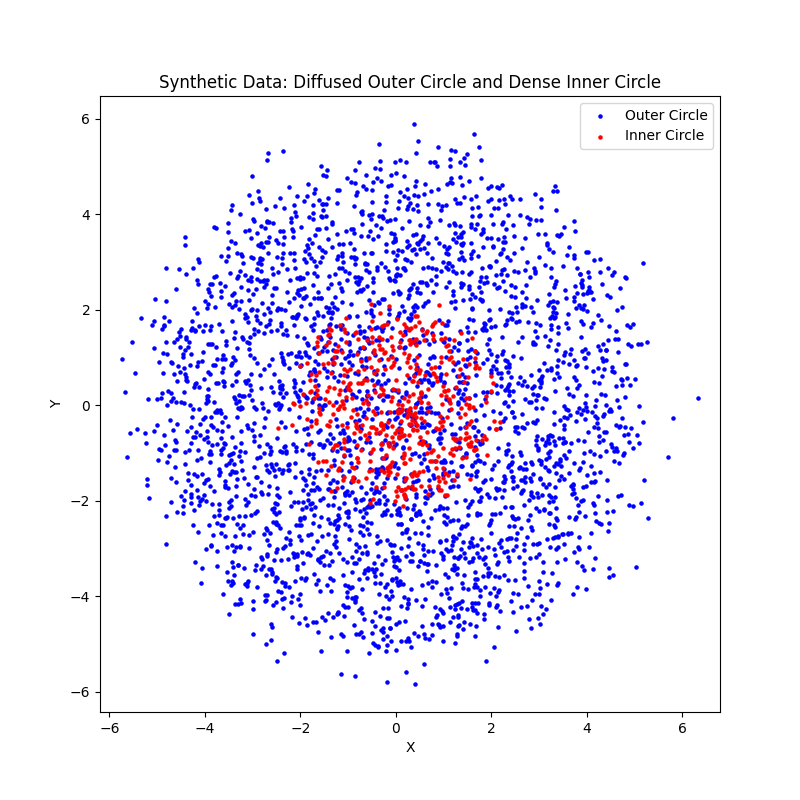

Figure: Synthetic dataset generation
</center>

### 2.3 GMM vs KDE
- I tried both KDE and GMM model on above dataset. Following plots shows how KDE and GMM(with 2 components as well as 5 components) fit the above dataset
<center>
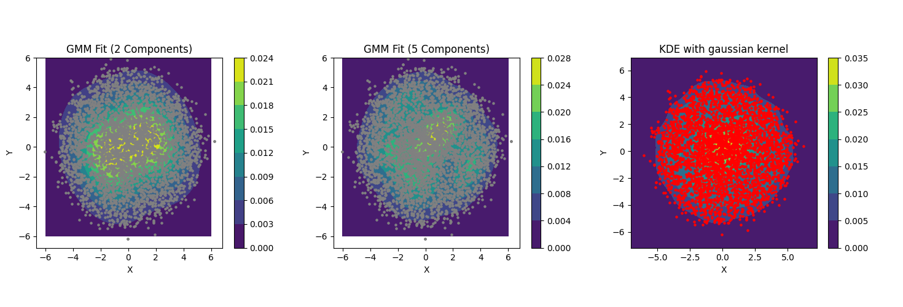

Figure: GMM and KDE on synthetic dataset
</center>

> KDE
> - KDE successfully captured the overall shape of both circular distributions
> - The density estimate was smooth and continuous across the entire space 

> GMM
> - GMM with 2 components
>      - Captured the general structure of the two circles
>      - May have oversimplified the density variations within each circle
> - GMM with 5 components
>      - Provided a more detailed representation of density variations
>      - Risked overfitting by potentially introducing artificial substructures

**The KDE model appears to consistently fit the data well as we can see the higher densities near the dense distribution. Also in the sparse distribution of data the densities are low so overall the KDE plot is consistent with the actual distribution.**

---
## Question 3: Hidden markov Model

### 3.2: Dataset
- Using librosa library I extracted the MFCC features from digits audio files. I visualized the MFCC features as a heatmap. Following plots shows these heatmaps for each digit.
<center>
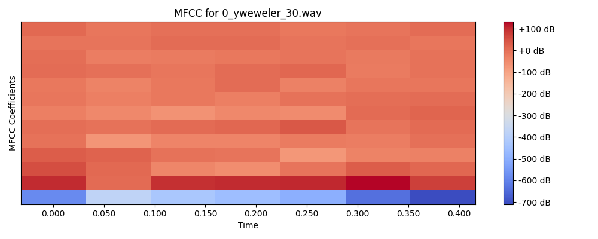
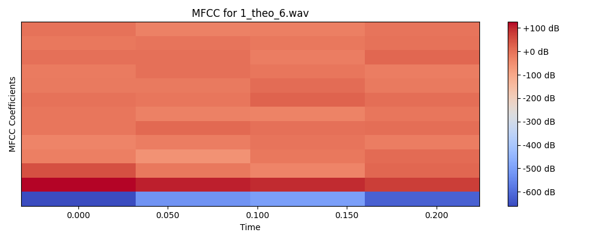
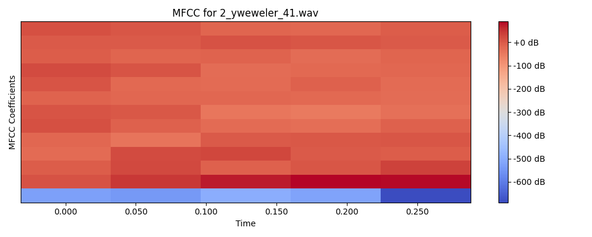
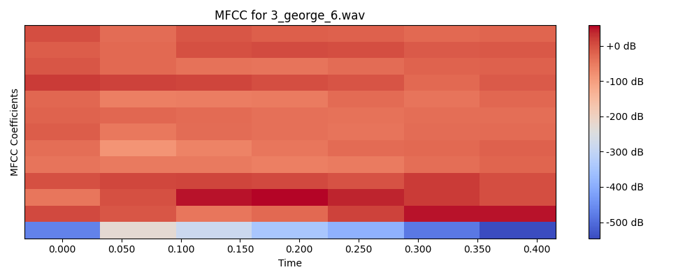
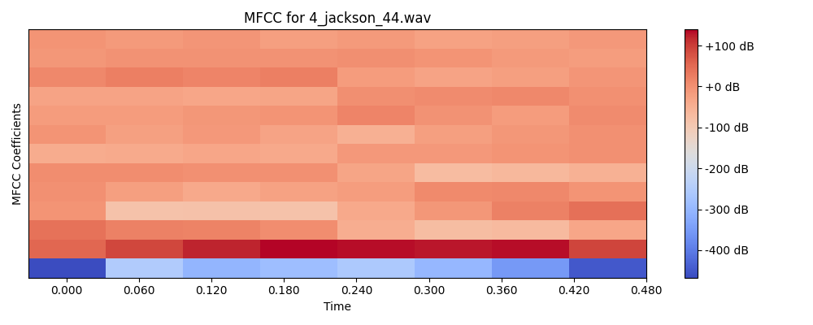
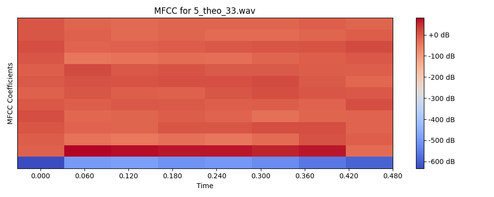
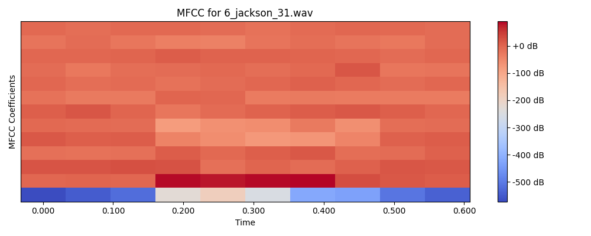
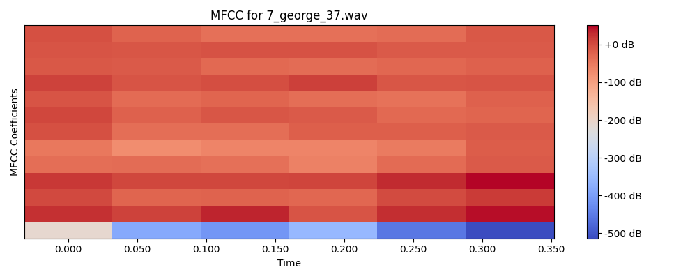
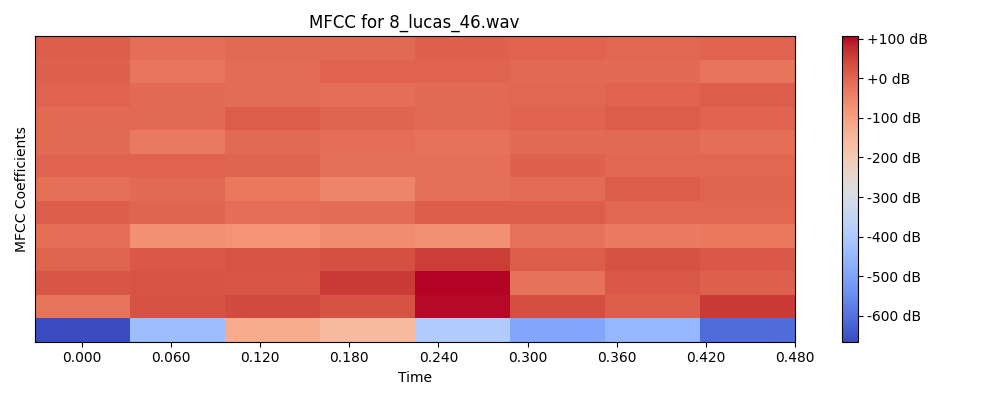
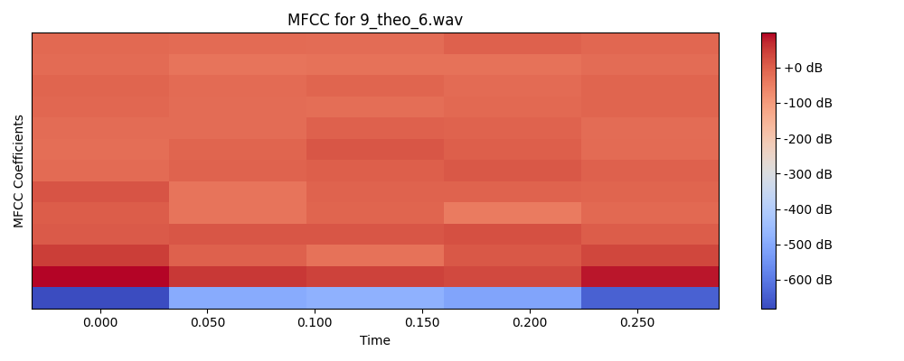
</center>

- From these plots distinct temporal progression from left to right in the MFCC feature values with time. For ex. Digit 0 shows strong features in the first coefficients that evolve over 8 frames, Digit 1 shows more compact pattern over ~5 frames and similarly for other digits.
- Since HMMs are designed to model such sequetial data where the current state depends on previous states. The MFCC patterns shows such sequetial progression. Hence HMMs are suitable for this task.

### 3.4 Metrics
- I test the above model on test set and got **90.00%** accuracy
- I also test this model on my personal recordings of digts and got following predictions for each digit. 
- Overall I got the accuracy of **30%** on personal recordings. 
- This model is performing better on test dataset as compared to personal recordings. This can be due to noise present in personal recordings.

```
Trained HMM model for digit 1
Trained HMM model for digit 7
Trained HMM model for digit 3
Trained HMM model for digit 2
Trained HMM model for digit 8
Trained HMM model for digit 6
Trained HMM model for digit 5
Trained HMM model for digit 4
Trained HMM model for digit 9
Trained HMM model for digit 0
True digit: 4, Predicted digit: 4
True digit: 4, Predicted digit: 4
True digit: 4, Predicted digit: 4
True digit: 4, Predicted digit: 4
True digit: 4, Predicted digit: 4
True digit: 4, Predicted digit: 4
True digit: 4, Predicted digit: 4
True digit: 4, Predicted digit: 4
True digit: 4, Predicted digit: 4
True digit: 4, Predicted digit: 4
True digit: 4, Predicted digit: 4
True digit: 4, Predicted digit: 4
True digit: 4, Predicted digit: 4
True digit: 4, Predicted digit: 4
True digit: 4, Predicted digit: 1
True digit: 4, Predicted digit: 4
True digit: 4, Predicted digit: 4
True digit: 4, Predicted digit: 4
True digit: 4, Predicted digit: 4
True digit: 4, Predicted digit: 4
True digit: 4, Predicted digit: 4
True digit: 4, Predicted digit: 4
True digit: 4, Predicted digit: 4
True digit: 4, Predicted digit: 4
True digit: 4, Predicted digit: 4
True digit: 4, Predicted digit: 4
True digit: 4, Predicted digit: 4
True digit: 4, Predicted digit: 4
True digit: 4, Predicted digit: 4
True digit: 4, Predicted digit: 4
True digit: 0, Predicted digit: 0
True digit: 0, Predicted digit: 3
True digit: 0, Predicted digit: 0
True digit: 0, Predicted digit: 0
True digit: 0, Predicted digit: 0
True digit: 0, Predicted digit: 0
True digit: 0, Predicted digit: 0
True digit: 0, Predicted digit: 0
True digit: 0, Predicted digit: 0
True digit: 0, Predicted digit: 0
True digit: 0, Predicted digit: 0
True digit: 0, Predicted digit: 0
True digit: 0, Predicted digit: 1
True digit: 0, Predicted digit: 0
True digit: 0, Predicted digit: 3
True digit: 0, Predicted digit: 0
True digit: 0, Predicted digit: 0
True digit: 0, Predicted digit: 0
True digit: 0, Predicted digit: 0
True digit: 0, Predicted digit: 0
True digit: 0, Predicted digit: 1
True digit: 0, Predicted digit: 0
True digit: 0, Predicted digit: 0
True digit: 0, Predicted digit: 0
True digit: 0, Predicted digit: 0
True digit: 0, Predicted digit: 0
True digit: 0, Predicted digit: 0
True digit: 0, Predicted digit: 0
True digit: 0, Predicted digit: 0
True digit: 0, Predicted digit: 0
True digit: 3, Predicted digit: 3
True digit: 3, Predicted digit: 3
True digit: 3, Predicted digit: 3
True digit: 3, Predicted digit: 3
True digit: 3, Predicted digit: 3
True digit: 3, Predicted digit: 3
True digit: 3, Predicted digit: 3
True digit: 3, Predicted digit: 3
True digit: 3, Predicted digit: 3
True digit: 3, Predicted digit: 3
True digit: 3, Predicted digit: 3
True digit: 3, Predicted digit: 3
True digit: 3, Predicted digit: 3
True digit: 3, Predicted digit: 3
True digit: 3, Predicted digit: 3
True digit: 3, Predicted digit: 6
True digit: 3, Predicted digit: 3
True digit: 3, Predicted digit: 3
True digit: 3, Predicted digit: 3
True digit: 3, Predicted digit: 3
True digit: 3, Predicted digit: 3
True digit: 3, Predicted digit: 3
True digit: 3, Predicted digit: 3
True digit: 3, Predicted digit: 3
True digit: 3, Predicted digit: 3
True digit: 3, Predicted digit: 3
True digit: 3, Predicted digit: 3
True digit: 3, Predicted digit: 3
True digit: 3, Predicted digit: 3
True digit: 3, Predicted digit: 3
True digit: 6, Predicted digit: 6
True digit: 6, Predicted digit: 8
True digit: 6, Predicted digit: 3
True digit: 6, Predicted digit: 6
True digit: 6, Predicted digit: 8
True digit: 6, Predicted digit: 6
True digit: 6, Predicted digit: 6
True digit: 6, Predicted digit: 6
True digit: 6, Predicted digit: 6
True digit: 6, Predicted digit: 3
True digit: 6, Predicted digit: 6
True digit: 6, Predicted digit: 6
True digit: 6, Predicted digit: 6
True digit: 6, Predicted digit: 6
True digit: 6, Predicted digit: 6
True digit: 6, Predicted digit: 6
True digit: 6, Predicted digit: 6
True digit: 6, Predicted digit: 6
True digit: 6, Predicted digit: 6
True digit: 6, Predicted digit: 6
True digit: 6, Predicted digit: 6
True digit: 6, Predicted digit: 6
True digit: 6, Predicted digit: 6
True digit: 6, Predicted digit: 8
True digit: 6, Predicted digit: 3
True digit: 6, Predicted digit: 8
True digit: 6, Predicted digit: 6
True digit: 6, Predicted digit: 6
True digit: 6, Predicted digit: 6
True digit: 6, Predicted digit: 3
True digit: 9, Predicted digit: 9
True digit: 9, Predicted digit: 9
True digit: 9, Predicted digit: 9
True digit: 9, Predicted digit: 9
True digit: 9, Predicted digit: 9
True digit: 9, Predicted digit: 9
True digit: 9, Predicted digit: 9
True digit: 9, Predicted digit: 9
True digit: 9, Predicted digit: 9
True digit: 9, Predicted digit: 9
True digit: 9, Predicted digit: 5
True digit: 9, Predicted digit: 1
True digit: 9, Predicted digit: 1
True digit: 9, Predicted digit: 9
True digit: 9, Predicted digit: 9
True digit: 9, Predicted digit: 9
True digit: 9, Predicted digit: 9
True digit: 9, Predicted digit: 9
True digit: 9, Predicted digit: 9
True digit: 9, Predicted digit: 9
True digit: 9, Predicted digit: 1
True digit: 9, Predicted digit: 9
True digit: 9, Predicted digit: 1
True digit: 9, Predicted digit: 9
True digit: 9, Predicted digit: 9
True digit: 9, Predicted digit: 1
True digit: 9, Predicted digit: 9
True digit: 9, Predicted digit: 9
True digit: 9, Predicted digit: 9
True digit: 9, Predicted digit: 1
True digit: 1, Predicted digit: 1
True digit: 1, Predicted digit: 1
True digit: 1, Predicted digit: 1
True digit: 1, Predicted digit: 1
True digit: 1, Predicted digit: 1
True digit: 1, Predicted digit: 1
True digit: 1, Predicted digit: 1
True digit: 1, Predicted digit: 1
True digit: 1, Predicted digit: 1
True digit: 1, Predicted digit: 1
True digit: 1, Predicted digit: 1
True digit: 1, Predicted digit: 1
True digit: 1, Predicted digit: 1
True digit: 1, Predicted digit: 1
True digit: 1, Predicted digit: 1
True digit: 1, Predicted digit: 1
True digit: 1, Predicted digit: 1
True digit: 1, Predicted digit: 1
True digit: 1, Predicted digit: 1
True digit: 1, Predicted digit: 1
True digit: 1, Predicted digit: 1
True digit: 1, Predicted digit: 1
True digit: 1, Predicted digit: 1
True digit: 1, Predicted digit: 1
True digit: 1, Predicted digit: 1
True digit: 1, Predicted digit: 1
True digit: 1, Predicted digit: 1
True digit: 1, Predicted digit: 1
True digit: 1, Predicted digit: 1
True digit: 1, Predicted digit: 1
True digit: 7, Predicted digit: 7
True digit: 7, Predicted digit: 7
True digit: 7, Predicted digit: 7
True digit: 7, Predicted digit: 7
True digit: 7, Predicted digit: 7
True digit: 7, Predicted digit: 7
True digit: 7, Predicted digit: 7
True digit: 7, Predicted digit: 7
True digit: 7, Predicted digit: 7
True digit: 7, Predicted digit: 7
True digit: 7, Predicted digit: 7
True digit: 7, Predicted digit: 7
True digit: 7, Predicted digit: 7
True digit: 7, Predicted digit: 7
True digit: 7, Predicted digit: 7
True digit: 7, Predicted digit: 7
True digit: 7, Predicted digit: 7
True digit: 7, Predicted digit: 7
True digit: 7, Predicted digit: 7
True digit: 7, Predicted digit: 7
True digit: 7, Predicted digit: 1
True digit: 7, Predicted digit: 7
True digit: 7, Predicted digit: 7
True digit: 7, Predicted digit: 7
True digit: 7, Predicted digit: 7
True digit: 7, Predicted digit: 7
True digit: 7, Predicted digit: 7
True digit: 7, Predicted digit: 7
True digit: 7, Predicted digit: 7
True digit: 7, Predicted digit: 7
True digit: 8, Predicted digit: 8
True digit: 8, Predicted digit: 8
True digit: 8, Predicted digit: 8
True digit: 8, Predicted digit: 8
True digit: 8, Predicted digit: 8
True digit: 8, Predicted digit: 8
True digit: 8, Predicted digit: 3
True digit: 8, Predicted digit: 8
True digit: 8, Predicted digit: 8
True digit: 8, Predicted digit: 8
True digit: 8, Predicted digit: 8
True digit: 8, Predicted digit: 8
True digit: 8, Predicted digit: 8
True digit: 8, Predicted digit: 8
True digit: 8, Predicted digit: 8
True digit: 8, Predicted digit: 8
True digit: 8, Predicted digit: 8
True digit: 8, Predicted digit: 8
True digit: 8, Predicted digit: 8
True digit: 8, Predicted digit: 8
True digit: 8, Predicted digit: 8
True digit: 8, Predicted digit: 8
True digit: 8, Predicted digit: 8
True digit: 8, Predicted digit: 8
True digit: 8, Predicted digit: 8
True digit: 8, Predicted digit: 3
True digit: 8, Predicted digit: 8
True digit: 8, Predicted digit: 8
True digit: 8, Predicted digit: 8
True digit: 8, Predicted digit: 8
True digit: 2, Predicted digit: 2
True digit: 2, Predicted digit: 2
True digit: 2, Predicted digit: 2
True digit: 2, Predicted digit: 2
True digit: 2, Predicted digit: 2
True digit: 2, Predicted digit: 2
True digit: 2, Predicted digit: 2
True digit: 2, Predicted digit: 2
True digit: 2, Predicted digit: 2
True digit: 2, Predicted digit: 2
True digit: 2, Predicted digit: 2
True digit: 2, Predicted digit: 2
True digit: 2, Predicted digit: 2
True digit: 2, Predicted digit: 2
True digit: 2, Predicted digit: 2
True digit: 2, Predicted digit: 2
True digit: 2, Predicted digit: 2
True digit: 2, Predicted digit: 2
True digit: 2, Predicted digit: 2
True digit: 2, Predicted digit: 2
True digit: 2, Predicted digit: 2
True digit: 2, Predicted digit: 2
True digit: 2, Predicted digit: 2
True digit: 2, Predicted digit: 2
True digit: 2, Predicted digit: 2
True digit: 2, Predicted digit: 2
True digit: 2, Predicted digit: 2
True digit: 2, Predicted digit: 2
True digit: 2, Predicted digit: 2
True digit: 2, Predicted digit: 2
True digit: 5, Predicted digit: 5
True digit: 5, Predicted digit: 1
True digit: 5, Predicted digit: 5
True digit: 5, Predicted digit: 5
True digit: 5, Predicted digit: 5
True digit: 5, Predicted digit: 5
True digit: 5, Predicted digit: 1
True digit: 5, Predicted digit: 5
True digit: 5, Predicted digit: 5
True digit: 5, Predicted digit: 5
True digit: 5, Predicted digit: 1
True digit: 5, Predicted digit: 5
True digit: 5, Predicted digit: 5
True digit: 5, Predicted digit: 5
True digit: 5, Predicted digit: 1
True digit: 5, Predicted digit: 5
True digit: 5, Predicted digit: 5
True digit: 5, Predicted digit: 5
True digit: 5, Predicted digit: 5
True digit: 5, Predicted digit: 5
True digit: 5, Predicted digit: 1
True digit: 5, Predicted digit: 5
True digit: 5, Predicted digit: 5
True digit: 5, Predicted digit: 5
True digit: 5, Predicted digit: 5
True digit: 5, Predicted digit: 3
True digit: 5, Predicted digit: 5
True digit: 5, Predicted digit: 5
True digit: 5, Predicted digit: 5
True digit: 5, Predicted digit: 5
Accuracy: 90.00%
True digit: 2, Predicted digit: 0
True digit: 2, Predicted digit: 0
True digit: 2, Predicted digit: 0
True digit: 2, Predicted digit: 0
True digit: 9, Predicted digit: 5
True digit: 9, Predicted digit: 5
True digit: 9, Predicted digit: 9
True digit: 9, Predicted digit: 9
True digit: 5, Predicted digit: 5
True digit: 5, Predicted digit: 5
True digit: 5, Predicted digit: 9
True digit: 5, Predicted digit: 5
True digit: 4, Predicted digit: 5
True digit: 4, Predicted digit: 4
True digit: 4, Predicted digit: 5
True digit: 4, Predicted digit: 5
True digit: 7, Predicted digit: 9
True digit: 7, Predicted digit: 9
True digit: 7, Predicted digit: 9
True digit: 7, Predicted digit: 9
True digit: 3, Predicted digit: 0
True digit: 3, Predicted digit: 9
True digit: 3, Predicted digit: 6
True digit: 3, Predicted digit: 1
True digit: 0, Predicted digit: 0
True digit: 0, Predicted digit: 9
True digit: 0, Predicted digit: 0
True digit: 0, Predicted digit: 0
True digit: 6, Predicted digit: 5
True digit: 6, Predicted digit: 6
True digit: 6, Predicted digit: 6
True digit: 6, Predicted digit: 7
True digit: 1, Predicted digit: 5
True digit: 1, Predicted digit: 5
True digit: 1, Predicted digit: 5
True digit: 1, Predicted digit: 5
True digit: 8, Predicted digit: 6
True digit: 8, Predicted digit: 6
True digit: 8, Predicted digit: 8
True digit: 8, Predicted digit: 6
Generalization Accuracy on Personal Recordings: 30.00%
```

---

## Question 4 Recurrent Neural Networks
### 4.1 Counting Bits
#### 4.1.1 Task 1: Dataset
- I construct a dataset of 100k sequences of random bits with lengths varying from 1 to 16, where each sequence is paired with a label indicating the count of 1's in the sequence. 
- I split this dataset in training, validation, and test split with ratios (0.8, 0.1, 0.1). 

#### 4.1.2 Task 2: Architecture 
- I Implemented RNN based model to count number of 1's in given binary sequence. The corresponding code is located in *bit_counting_model.py*. 

#### 4.1.3 Task 3: Training 
- I trained the above model on dataset generated in 4.1.1. 
- I used MAE as evaluation metric. I evaluated this model on test set got the following results. 
    - **MAE on Test Set** : 0.0044
- I computed random baseline results on test set 
    - **MAE with Random Baseline** : 2.5557

 <center>
  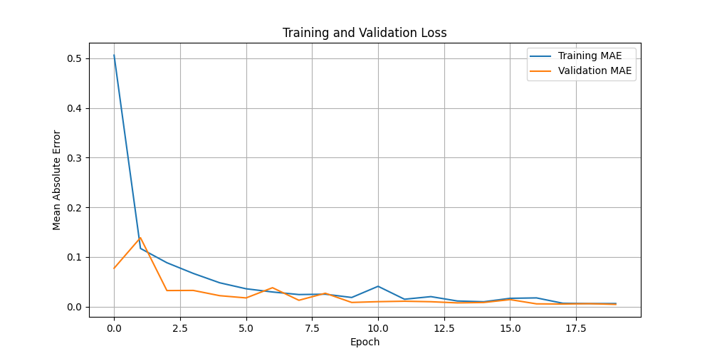     
  Figure: Epoch vs MAE  
</center>

#### 4.1.4 Task 4: Generalization 
- I tried to generalize this model on large sequence of length 17, 18 etc. Following plot shows MAEs for sequences with length from 1 to 32.  
 <center>
  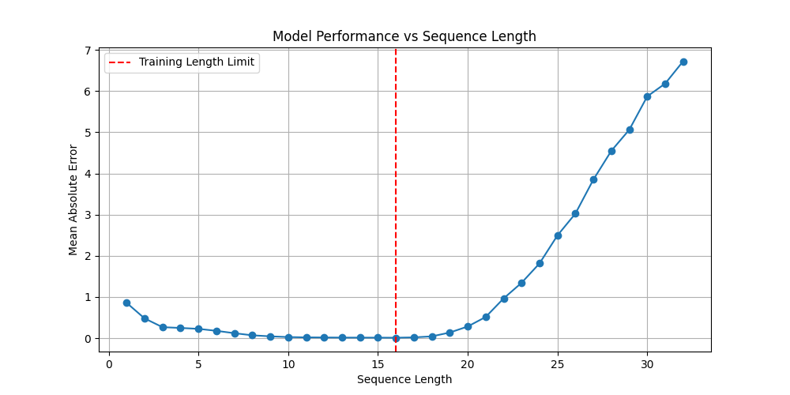     
  Figure: Sequence Length v/s MAE  
</center>
- We can see that MAE relatively low sequences of length less that 17 after that the MAE is increasing rapidly. 
- This is because We trained the model on sequences of length 1 to 16 So model performs well on these sequences but for larger sequences(17 to 32) it struggles because it was not exposed to these sequences during training. 